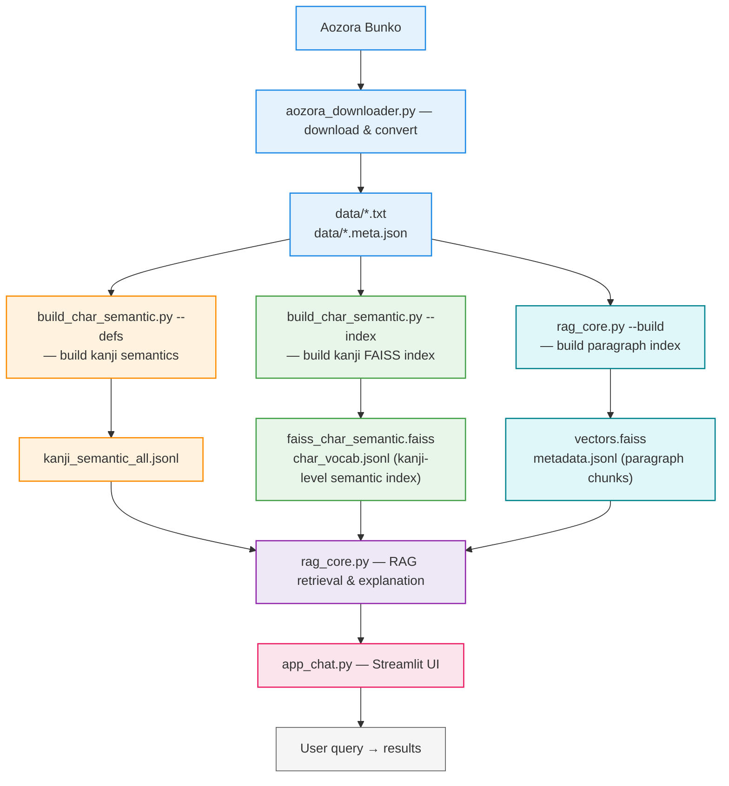

# DH 

#### 📚 *An Assignment for the Digital Humanities Course* 

---

## 🏯 Japanese Literary Name-Kanji Context Finder (RAG-based Web App)

**Japanese Literary Name-Kanji Context Finder** is a lightweight **Retrieval-Augmented Generation (RAG)** system that searches for where a given kanji character appears within classical Japanese literature from **Aozora Bunko (青空文庫)**.
It demonstrates how **text preprocessing**, **semantic embeddings**, **vector search**, and **LLM-based generation** can be combined to build a practical tool for ***Digital Humanities*** research.

This project was created as an assignment for the *Digital Humanities* course and also serves as a reusable mini-framework for RAG-based text exploration.

---

### 🌸 Project Overview

When a user inputs a kanji (e.g., **「瑩」**), the system:

1. **Searches all Aozora texts**
2. **Retrieves the sentence and paragraph containing the kanji**
3. **Links the matched context to title / author / Aozora card**
4. **Merges curated + generated kanji meanings**
5. **Uses Gemini + FAISS to produce a clean RAG-based explanation**

This project applies **modern NLP + vector search + LLM reasoning**  
to classical Japanese literature, making kanji-centric reading and analysis  
**fast, interactive, and scalable.**

---

### 🛠️ Tech Stack

| Layer | Tool / Library | Description |
|-------|----------------|--------------|
| Frontend | Streamlit | Interactive web app interface |
| Backend | Python| Main development language |
| Embeddings | Google Gemini Embeddings API | Convert text chunks into vectors |
| Vector DB | FAISS  | Efficient similarity search |
| LLM | Gemini | Generate summarized answers |
| Data | Aozora Bunko | Public domain Japanese literature |

---

### 🧩 System Architecture


| Layer | Components | Description |
|-------|------------|-------------|
| **Streamlit Frontend (UI)** | • Chat-style input<br>• Display matched excerpts<br>• Show source references | Handles user interaction and displays RAG results in a conversational interface. |
| **RAG Core (Python Backend)** | • Text preprocessing<br>• Chunking & embeddings<br>• Vector search (FAISS)<br>• Gemini LLM generation | Processes texts, builds embeddings, retrieves relevant excerpts, and generates explanations. |
| **Aozora Bunko Dataset** | • UTF-8 `.txt` files<br>• Metadata: title, author | Raw corpus used for retrieval, including downloaded classical literature. |

---

### 📂 Project Structure

```
DH/
├── app_chat.py                   # Streamlit chat UI 
├── rag_core.py                   # RAG pipeline + paragraph index builder (--build)
├── aozora_downloader.py          # Downloads & converts Aozora Bunko texts
├── build_char_semantic.py        # Builds kanji semantics (--defs) + kanji FAISS index (--index)
├── faiss_inspect.py              # Debug tool for FAISS index
├── make_missing_sidecars.py      # Utility script: regenerate missing metadata sidecar files for Aozora texts
├── requirements.txt              # Python dependencies
├── config.yaml                   # API keys & path settings (excluded from repo)
│
├── data/ (excluded from repo)
│   ├── *.txt                     # Aozora UTF-8 texts
│   ├── *.meta.json               # Metadata sidecars for corpus files; required for RAG indexing
│   ├── kanji_semantic.json       # user-curated semantics 
│   └── kanji_semantic_all.jsonl  # auto-generated semantics (--defs) 
│
└── index/ (excluded from repo)
│    ├── char_semantic/
│    │     ├── faiss_char_semantic.faiss   # kanji-level FAISS index
│    │     └── char_vocab.jsonl            # kanji-level metadata
│    └── faiss/
│          ├── vectors.faiss               # paragraph-level index (rag_core.py --build)
│          └── metadata.jsonl              # paragraph-level metadata
│ 
├── .gitignore                    # Git ignore rules (exclude cache, index files, API keys, etc.)
└── README.md                     # Main project overview, workflow description, and usage instructions

```

---

### 🔄 End-to-End Workflow



---

### ⚙️ Configuration (config.yaml)

This project uses a single configuration file, config.yaml, which stores API keys, model choices, and all index/corpus paths.
A valid configuration is required before running any of the build scripts (--defs, --index, --build) or launching the Streamlit app.

Below is the full structure used by this project:

```bash
api:
  # gemini_api_key: ""     # Add your Gemini API key here

models:
  embed: "text-embedding-004"
  llm: "gemini-2.0-flash"

chunking:
  max_chars: 1200
  overlap: 120

embedding:
  batch_size: 128
  normalize: true

index:
  dir: "index/faiss"
  metadata_jsonl: "metadata.jsonl"
  faiss_index: "vectors.faiss"

char_index:
  dir: index/char_semantic
  faiss: faiss_char_semantic.faiss
  vocab: char_vocab.jsonl
  seed_json: data/kanji_semantic.json  # optional curated seed dictionary
```
***Notes***

- ***gemini_api_key*** must be provided by the user.(The key is excluded from the repository for security.) 

- All ***index directories*** (index/faiss, index/char_semantic/) will be created automatically by the scripts. 

- data/ and index/ contents are ***NOT*** included in the repo; users must generate them via the commands provided in the next section. 

- ***seed_json*** is optional and used for enriching the kanji semantic dictionary during incremental updates. 


---

### 🧪 Build & Usage Commands
#### 1. Download Aozora Texts

Download specific author:

```bash
python aozora_downloader.py --author "夏目漱石"
```

Random N works:

```bash
python aozora_downloader.py --random 5
```

Download by card ID:

```bash
python aozora_downloader.py --card-id 7799
```
#### 2. Build Kanji Semantics (Two-Step)
##### Step A — Generate semantic dictionary
```bash
python build_char_semantic.py --defs

Outputs:

kanji_semantic_all.jsonl
```
##### Step B — Build FAISS index (kanji-level)
```bash
python build_char_semantic.py --index

Outputs:

index/char_semantic/faiss_char_semantic.faiss
index/char_semantic/char_vocab.jsonl
```
#### 3. Build Paragraph-Level Index (RAG Core)
```bash
python rag_core.py --build

Outputs:

index/faiss/vectors.faiss
index/faiss/metadata.jsonl

This index enables full-paragraph context retrieval.
```

#### 4. Run the Web App

```bash
streamlit run app_chat.py
```

---

### 🧠 Workflow Summary

**Preprocessing** – Download Aozora texts, normalize formatting, clean markup, and split content into sentences and paragraphs. Generate per-text sidecar metadata (`*.meta.json`).

**Kanji Semantics** – Build curated + auto-generated kanji meanings (`--defs`), then create a kanji-level FAISS index (`--index`).

**Embedding & Indexing** – Use Gemini Embeddings to encode paragraphs and store them in a paragraph-level FAISS index (`rag_core.py --build`).

**Retrieval** – Convert the user’s kanji into embeddings, search both kanji-level and paragraph-level indexes, and gather matched contexts with metadata.

**Generation** – Combine context + kanji meanings and feed them to Gemini to produce a concise, literature-aware Japanese explanation.


---

### 💡 References


青空文庫: https://www.aozora.gr.jp/   
FAISS: https://github.com/facebookresearch/faiss  
Streamlit Docs: https://docs.streamlit.io/  
Google Generative AI SDK: https://ai.google.dev/   

---

### 📑 Citation

If you find this project helpful for your study, research, or teaching,
you may reference it using the DOI below:

[](https://doi.org/10.5281/zenodo.17667425)

